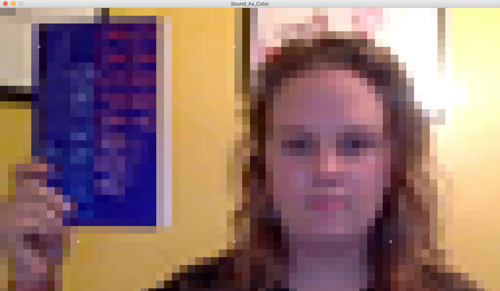

# Color-As-Sound
### Interactive App: Triggers Sounds from certain HEX colors

Sound As Color is an interactive soundscape where each pixel (& it's corresponding color) is converted into a sound byte. The project was built in Processing. This was a collaboration piece with Zachery Dekker.

<table>
  <td></td>
  <td></td>  
</table>

